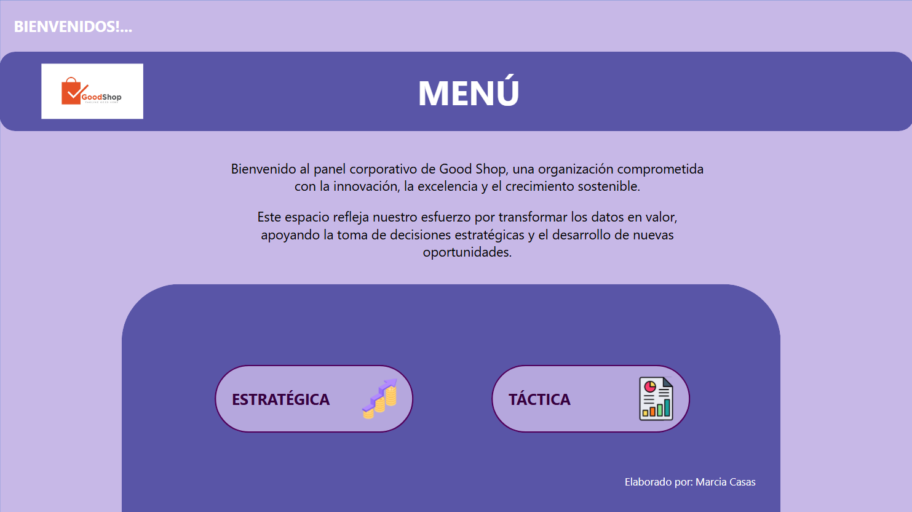
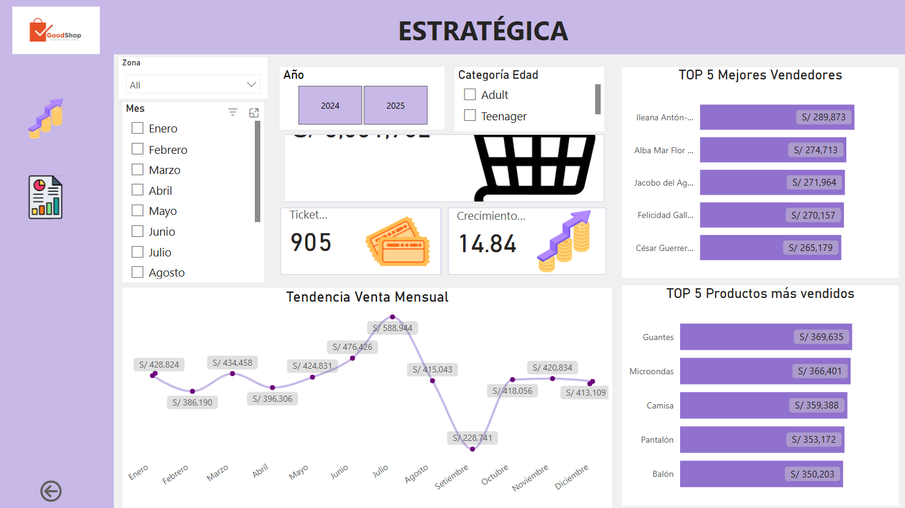
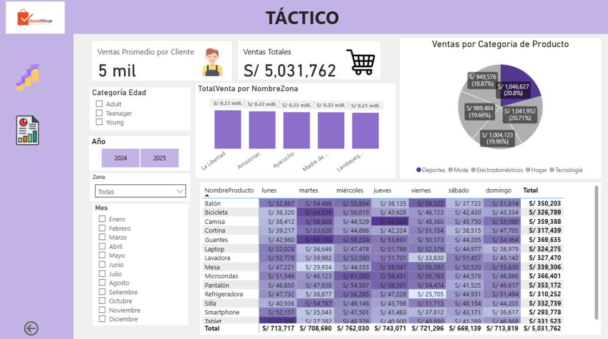

  

# 📊 Dashboard de Ventas – Power BI

Proyecto desarrollado como parte de un **workshop práctico especializado en Power BI**, orientado a la creación de dashboards estratégicos y tácticos para el análisis del desempeño comercial. El tablero integra KPIs clave, visualizaciones interactivas y segmentadores que permiten comprender fácilmente el comportamiento de las ventas a diferentes niveles.

---

## 🚀 Objetivo del Proyecto
Diseñar un dashboard de ventas que permita:
- Evaluar el rendimiento general mediante indicadores clave.
- Analizar tendencias y rankings para la toma de decisiones estratégicas.
- Explorar detalles de ventas por categoría, zona, cliente y tiempo.
- Facilitar la interacción con los datos mediante visualizaciones dinámicas.

---

## 🧠 Enfoques del Análisis

### 🔹 Nivel Estratégico
Enfocado en decisiones de alto nivel:
- KPIs principales.
- Tendencias de ventas.
- Rankings de productos y vendedores.

### 🔹 Nivel Táctico
Uso detallado para análisis específicos:
- Ventas por categoría de producto.
- Distribución por zonas geográficas.
- Análisis por clientes.
- Comportamiento por días de la semana.

---

## 📌 KPIs Implementados
- **Ventas Totales:** mide el desempeño global del negocio.  
- **Ticket Promedio:** indica el gasto promedio por cliente.  
- **Crecimiento %:** compara periodos para evaluar la evolución.  

---

## 🧩 Tecnologías y Herramientas
- **Power BI Desktop**
- **Power BI Service**
- Modelado de datos  
- Visualizaciones interactivas  
- Segmentadores y filtros dinámicos  

---

## 🖼️ Capturas del Dashboard
  
  

---
## 🎯 Aprendizajes Obtenidos
- Diferenciar dashboards estratégicos y tácticos.
- Seleccionar visualizaciones apropiadas para cada análisis.
- Implementación de KPIs, segmentadores y filtros dinámicos.
- Integración de conceptos de BI con práctica real en Power BI.

---
## 🌐 Dashboard Interactivo

Accede al informe publicado en Power BI Service:
👉 **Enlace público:** https://app.powerbi.com/view?r=eyJrIjoiOTE0MTk1MGEtMzBjYS00MDY2LWI3MDQtZTYxYTAzYjZjOTdkIiwidCI6Ijc2NzM0NDQ5LTkzNGQtNGFlNy1hYzUzLWE5YmZkOTY5MTJjOSIsImMiOjR9

---

## 📄 Archivos Incluidos
- 📘 **Reporte PDF:** Detalle del Proyecto (`Dashboard_Ventas_PowerBI.pdf`)
- 📁 **Archivo PBIX:** Dashboard completo en Power BI
- 🖼️ **Imágenes:** Capturas del tablero (carpeta `img/`)

---

